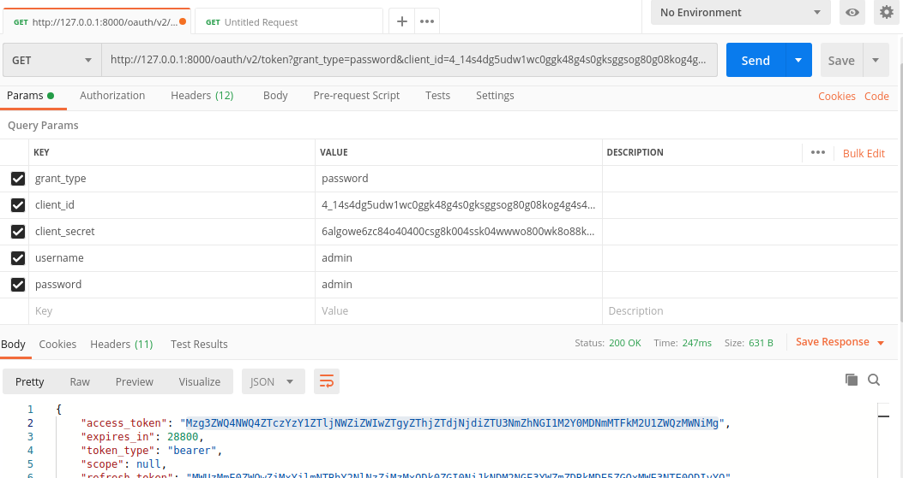

# [Symfony 4.4] API REST: OAuth2 + FOS

#####The API we are creating in this gist will follow these rules :

- [x] The API only returns JSON responses
- [x] All API routes require authentication
- [x] Authentication is handled via OAuth2 with `password` Grant Type only (no need for Authorization pages and such).
- [x] API versioning is managed via a subdomain (e.g. `v1.api.example.com`)

The API will be written in PHP 7.2 with the Symfony 4.4 framework. The following SF2 bundles are used :

- https://github.com/FriendsOfSymfony/FOSUserBundle
- https://github.com/FriendsOfSymfony/FOSOAuthServerBundle
- https://github.com/FriendsOfSymfony/FOSRestBundle

### Clone project from GitHub

`git clone git@github.com:rachedbelhadj/symfony_fos_oauth.git`

### .env file

`cp env.dest .env`

### Update database access

DATABASE_NAME="demo" 
DATABASE_USER="root" 
DATABASE_PASSWORD="root" 
DATABASE_PORT=3306 

### Install bundles

`composer install`

### Create schema data base

`bin/console doctrine:schema:update --force`

### Reload fixture data

`bin/console doctrine:fixture:load`

### Creating A Client OAuth

`bin/console fos:oauth-server:create-client --redirect-uri="localhost" --grant-type="password"`

### Server start

`bin/console server:start`

### Test Postman

`GET /oauth/v2/token?grant_type=password&client_id=4_14s4dg5udw1wc0ggk48g4s0gksggsog80g08kog4g4s4oggk04&client_secret=6algowe6zc84o40400csg8k004ssk04wwwo800wk8o88k8k8sw&username=admin&password=admin HTTP/1.1
 Host: 127.0.0.1:8000`

